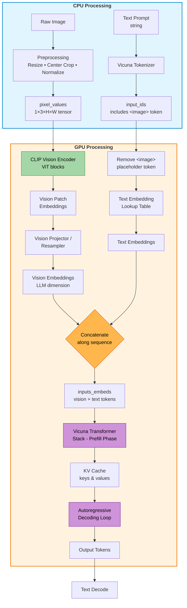

# Vision-Language Model Architecture Flow

```mermaid
graph TB
    subgraph CPU["<b>CPU Processing</b>"]
        A[Raw Image] --> B[Preprocessing<br/>Resize • Center Crop • Normalize]
        B --> C[pixel_values<br/>1×3×H×W tensor]
        
        D[Text Prompt<br/>string] --> E[Vicuna Tokenizer]
        E --> F[input_ids<br/>includes &lt;image&gt; token]
    end
    
    subgraph GPU["<b>GPU Processing</b>"]
        C --> G[CLIP Vision Encoder<br/>ViT blocks]
        G --> H[Vision Patch<br/>Embeddings]
        H --> I[Vision Projector /<br/>Resampler]
        I --> J[Vision Embeddings<br/>LLM dimension]
        
        F --> K[Remove &lt;image&gt;<br/>placeholder token]
        K --> L[Text Embedding<br/>Lookup Table]
        L --> M[Text Embeddings]
        
        J --> N{Concatenate<br/>along sequence}
        M --> N
        
        N --> O[inputs_embeds<br/>vision + text tokens]
        O --> P[Vicuna Transformer<br/>Stack - Prefill Phase]
        P --> Q[KV Cache<br/>keys & values]
        Q --> R[Autoregressive<br/>Decoding Loop]
        R --> S[Output Tokens]
    end
    
    S --> T[Text Decode]
    
    style CPU fill:#e1f5ff,stroke:#0288d1,stroke-width:2px
    style GPU fill:#fff3e0,stroke:#f57c00,stroke-width:2px
    style G fill:#a5d6a7,stroke:#388e3c,color:#000
    style P fill:#ce93d8,stroke:#7b1fa2,color:#000
    style R fill:#ce93d8,stroke:#7b1fa2,color:#000
    style N fill:#ffb74d,stroke:#e65100,color:#000
```